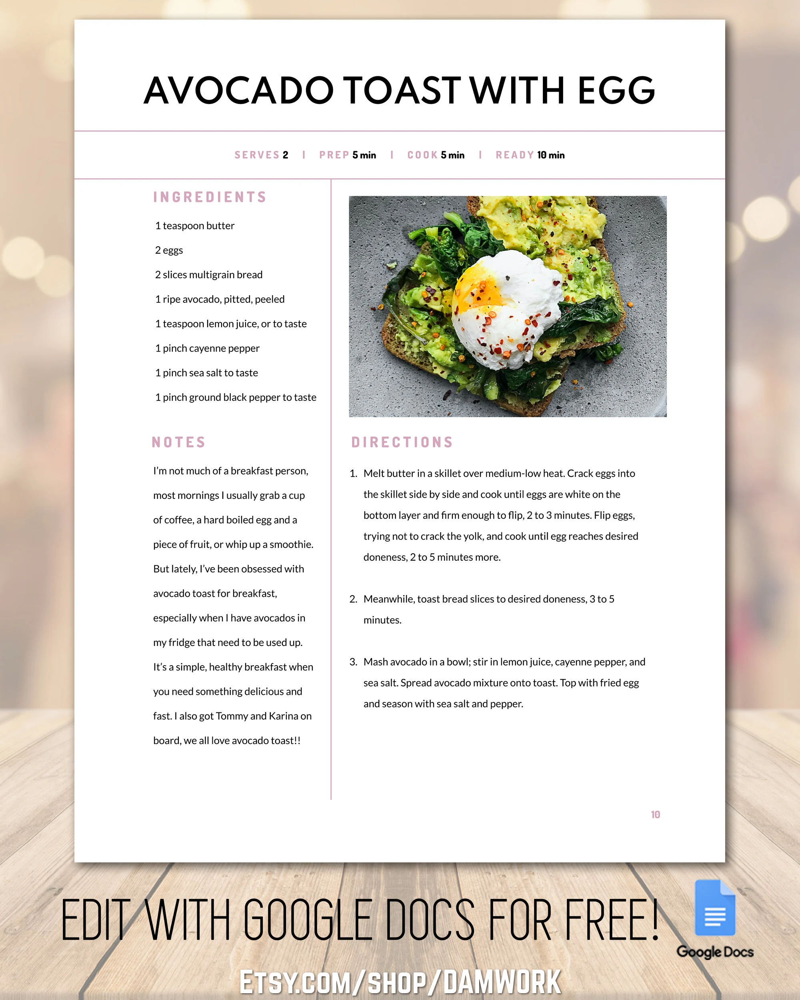

# What should I eat?

This is a big question of the day usually. I always struggly with what to cook for my next meal that doesn't require me to go the the grocery store again. After endless browsing on internet, I usually end up with something simple, unhealthy, or ordering takeout.

To tackle this problem, this project will provide recipes for the ingredients we already have in the kitchen.

## Requirements

`FLASK`
`pandas`
`spacy`
`en_core_web_sm`
`python 3.9`

## Description

This is a Flask App to filter recipes via matching mechanism using nltk library.
Currently its set to match 90% of the ingredients but this can easily be made variable.

## Deployment

The app is deployed in Amazon Elastic Kubernetes Cluster (EKS).
The docker image is pushed to Amazon Elastic Container Registry (ECR) via Github pipeline.

## Dataset
https://www.kaggle.com/datasets/shuyangli94/food-com-recipes-and-user-interactions?select=RAW_recipes.csv

